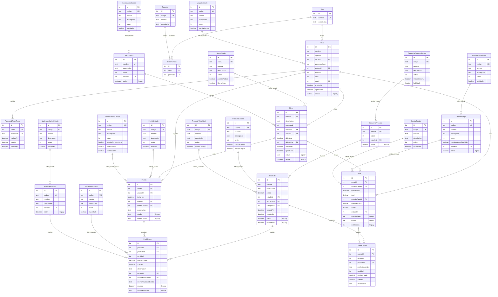

# DER - Bodegon Villa Maria

Este diagrama representa la estructura actual de la base de datos PostgreSQL en Neon.

Nota importante: algunas columnas antiguas siguen existiendo fisicamente como respaldo de migracion, pero ya no son la fuente principal del sistema. Estan marcadas como `legacy`.

## Tablas principales

- `User`: usuarios internos del sistema.
- `Role`: perfiles generales, por ejemplo administrador, empleado o cocina.
- `Permiso`: acciones permitidas dentro del sistema.
- `RolePermiso`: tabla intermedia que relaciona roles con permisos.
- `Mesa`: mesas fisicas del local.
- `Producto`: productos de la carta.
- `Pedido`: pedido abierto o finalizado de una mesa.
- `PedidoItem`: productos individuales dentro de un pedido.
- `Cuenta`: cierre de cuenta/cobro.
- `CuentaDetalle`: detalle historico de los productos cobrados.

## Tablas de catalogo y estado

- `UsuarioEstado`: define si un usuario puede acceder.
- `MesaEstado`: define si una mesa esta libre, ocupada o cerrada.
- `SectorMesa` y `SectorMesaEstado`: organizan mesas por sector y estado.
- `CategoriaProducto` y `CategoriaProductoEstado`: organizan productos por categoria y visibilidad.
- `ProductoEstado`: define si un producto se puede vender.
- `ProductoVisibilidad`: define si un producto aparece en el menu publico.
- `PedidoEstado`: define si un pedido esta activo, finalizado o anulado.
- `PedidoEstadoCocina`: define el avance del pedido en cocina.
- `PedidoItemEstado`: define si un item esta activo o anulado.
- `MotivoAnulacion` y `MotivoAnulacionEstado`: normalizan los motivos de anulacion.
- `MetodoPago` y `MetodoPagoEstado`: normalizan medios de pago.
- `CuentaEstado`: define el estado del cierre de cuenta.

## Columnas legacy

Estas columnas existen en Neon como respaldo de migracion, pero el software actual usa las relaciones normalizadas con `estadoId`, `visibilidadId`, `metodoPagoId`, etc.

- `User.estado`
- `Mesa.estado`
- `Mesa.activa`
- `Producto.activo`
- `Producto.visibleMenu`
- `Pedido.estado`
- `Pedido.estadoCocina`
- `PedidoItem.anulado`
- `PedidoItem.motivoAnulacion`
- `Cuenta.metodoPago`
- `Cuenta.estado`
- `Cuenta.detalleJson`
- `CategoriaProducto.visible`
- `MetodoPago.activo`
- `SectorMesa.activo`
- `MotivoAnulacion.activo`

## Normalizacion aplicada

- Los roles no dependen de condiciones fijas en el codigo: cada rol se conecta a permisos mediante `RolePermiso`.
- Los estados operativos no se guardan como texto libre principal: se referencian por claves foraneas.
- Los productos no dependen directamente de `activo` o `visibleMenu`: usan `ProductoEstado` y `ProductoVisibilidad`.
- Los items anulados no dependen solo de un booleano: usan `PedidoItemEstado` y `MotivoAnulacion`.
- Los cobros no guardan el detalle principal en JSON: usan `CuentaDetalle`.
- Los metodos de pago, categorias, sectores y motivos tienen estados propios normalizados.
